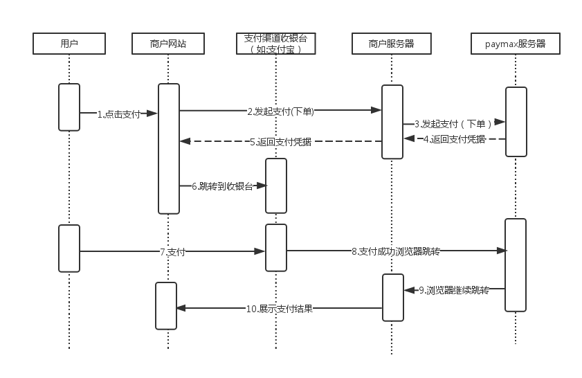

##PC网页、移动网页支付流程

支付流程大致如下

1. 用户在商户的网站上点击支付。
2. 商户网站向商户服务器发起支付（下单）请求。
3. 商户服务器自己生成完内部订单后，调用paymax服务器接口，发起下单请求。
4. paymax服务器此刻会向支付渠道下单（如：支付宝、微信），并将支付渠道返回的支付凭据返回给商户服务器。
5. 商户服务器收到支付凭据后，进行验签，验签通过后将支付凭据返回到商户网站。
6. 商户网站根据支付凭据调转到支付渠道的收银台。说明：支付凭据分两种：第一种是url，这种凭据商户在网站上做跳转即可；第二种是form表单，这种凭据商户需要在网站上post表单，即可跳转到收银台。
7. 用户在渠道的收银台输入支付密码等要素完成支付。
8. 支付成功后，收银台网站会跳转到paymax服务器。
9. paymax服务器对调转参数做统一处理，将各支付渠道的参数统一化，并跳转到商户服务器。
10. 商户服务器对跳转进行验签，并将支付结果展示给用户看。（此步跳转的支付结果不完全可靠，商户此时不可依赖跳转改变订单状态或给用户发货，可靠的支付结果需要依赖[webhooks通知](webhooks通知.md)）

