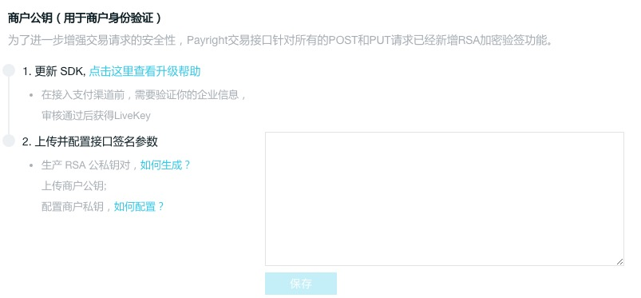
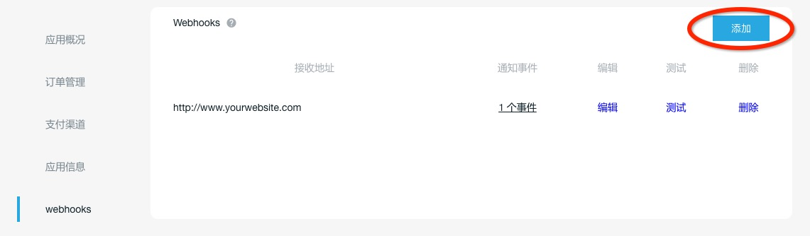
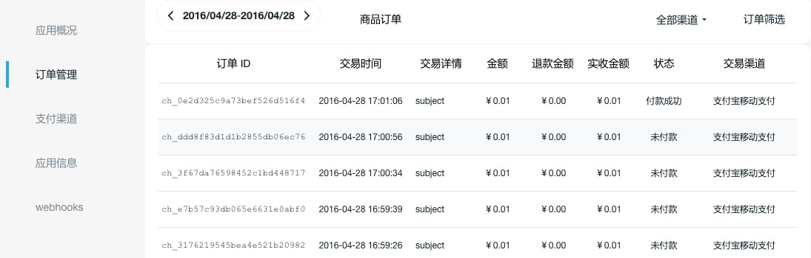
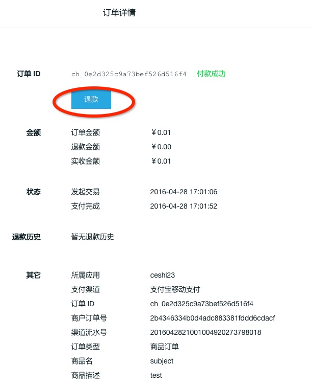

## 快速开始

如果您通过Paymax平台代申请开通渠道或者自行填写了渠道参数之后，就可以开始集成开发了。

### 1. 下载SDK

请在以下地址，根据您的应用平台和开发语言选择相应的SDK

Client SDK下载地址：

* [Android SDK](https://github.com/paymax/paymax-demo-android/archive/master.zip)
* [iOS SDK](https://github.com/paymax/paymax-demo-ios/archive/master.zip)

Server SDK下载地址：

* [Java版](https://github.com/paymax/paymax-server-sdk-java/archive/master.zip)
* [PHP版](https://github.com/paymax/paymax-server-sdk-php/archive/master.zip)
* [C#版](https://github.com/paymax/paymax-server-sdk-csharp/archive/master.zip)
* [NodeJS版](https://github.com/paymax/paymax-server-sdk-nodejs/archive/master.zip)
* [Python版](https://github.com/paymax/paymax-server-sdk-python/archive/master.zip)

其他版本的SDK正在开发中。

### 2. 集成开发

#### 服务器端集成
服务器端暂时只提供Java版SDK。

1. **生成和配置RSA签名密钥**

   Paymax的数据传输使用RSA签名来验证数据可靠性，因此需要设置RSA签名秘钥。

   Paymax Server SDK中提供了生成RSA密钥对的工具RSAKeyGenerateUtil，您可以直接用它来生成一对公私钥，并将公钥填写到Paymax网站“个人中心”-“基本信息”-“开发信息”中。

   如果您想自己生成RSA密钥，请参考[生成RSA密钥](rsa_generate.md)。

   **生成密钥对：**

   ```java
   RSAKeyGenerateUtil.genKey();
   ```


   **在Paymax网站设置商户公钥：**

   

2. **设置SecretKey和签名秘钥**

   在Paymax网站配置了商户公钥后，还需要在程序中配置以下三要素：
   * 商户私钥：和商户公钥对应的RSA私钥，上一步已经生成
   * Paymax公钥：向Paymax传输数据时需要使用Paymax公钥对数据签名，请到Paymax网站“基本信息”-“开发信息”-“Paymax公钥”查看
   * Secret Key：Paymax提供给商户的唯一标识，请到Paymax网站“基本信息”-“开发信息”-“Live Secret Key”查看


	配置代码示例：

	​```java
	public class SignConfig {
		//商户自己的私钥【用com.paymax.sign.RSAKeyGenerateUtil生成RSA秘钥对，公钥通过Paymax网站上传到Paymax，私钥设置到下面的变量中】
		public static final String PRIVATE_KEY = "MIICdwIBADANBgkqhkiG9w0BAQEFAASCAmEwggJdAgEAAoGBANTf5n0fstv7rQWNuZFmNjLm58t7+pRrxbyi8EzkzQmB2Bgv8SpabOIqezXYJM9HsNWuPgfadkkEBOAaPqYnzPl7ca8jGLTrdooaVEA9M7wNgYSxuxSDldtymk2BpDiBhX7Z++M8lCq5QW9dMK8pV5XtZ6vfXYtkiPROK1vbGi7DAgMBAAECgYEAm8gejIKeCY5sWBwXKOh70VRZXPglsGgOFLXI1Py7b7GtykWLX0s9U2VzNTwv8+Cq8DTLAERHO7fNOZL7Nez6emKWe2XBvCEWsN4xP5TFwBlnJvHSEh7my7GmwzVLlyyRUT+didEnfgw0yzxSjUamQ6Ct+dlMn44741oPELJHn8ECQQDxaFrq42FwpwOUc+yxtxPkcbVA6VfPermt3YwJfYz7EskDmQV0dFLSUfGxbG4QHKh5hRkvnzOaOWZyWwVVKzItAkEA4b4DUaGm0cezVZGYZDcRo7TlNrIzqrTjjIcuYZFm2+90imzkyrjkesFrC/yR7XEE5t+n3uUcrNPsMunb9eWqrwJBAKWzM3S2zlM80EA9seHqAEV1pyv+/r7zRjAJOe3pt7M+matWhWAB2Dd096kI/CMjCKEgssD1Tb42WBN2Vpq3I6ECQBJiH/EQ4f3pbmBEiA15MpWLULNAldaL/o/eHlfRuHemq23uaj9cCTc58xa5zcRxVL3cbtZHACvO4khPJRuERX8CQGyW2X5WqEVkWFjHcUoSzQNyPzISaX2eu6AU2DWTHNxhdE16XKlNLjFan3QFBt40cY8Uc+SXtf5nL6TAF3xDfqA=";
	
		//Paymax提供给商户的SecretKey，登录网站后查看
		public static final String SECRET_KEY = "8bf1ef218e2346c89c450d8482704dbd";
	
		//Paymax提供给商户的公钥，登录网站后查看
		public static final String PAYRIGHT_PUBLIC_KEY = "MIGfMA0GCSqGSIb3DQEBAQUAA4GNADCBiQKBgQCoFAWfTj6Zc9TCSpqqPzMHiEK9yjoLs74qKJvgxws2nTtsATrSeZp5Nzt2RHurwiFUKI6O/RCGk0HGbue0OGl6CVOc7Nyws46K7F2u9B1k+KzJ5Gc0lWVLZQ030Zd7tUT+nqhguQ09LnR3RmpGoglwkSRq894uZ5IxLXLY7qZKdQIDAQAB";
	}
	
	​```


3. 构造请求参数并发起支付请求，并解析服务器返回的支付凭证

   Server SDK已经很好的封装了访问支付API的过程，您只需要简单的配置参数并发起支付就可以了。
   支付API接口返回的支付凭证是一个json格式的Charge对象。<br>
   我们的Server SDK可以接收返回并且将其实例化为一个Charge对象，您可以直接使用。<br>

   ```java
   Map<String, Object> chargeMap = new HashMap<String, Object>();
   chargeMap.put("amount", 1);
   chargeMap.put("subject", "Your Subject");
   chargeMap.put("body", "Your Body");
   chargeMap.put("order_no", UUID.randomUUID());
   chargeMap.put("channel", "alipay_app");
   chargeMap.put("client_ip", "127.0.0.1");
   chargeMap.put("app", "app_49b0f1dd741646d2b277524de2785836");
   chargeMap.put("currency","CNY");
   chargeMap.put("description","description");
   Charge charge = Charge.create(chargeMap);
   ```

   如果您自行调用Paymax API，需要您自行解析返回的支付凭证，格式如下：

   ```json
   {
   		"app": "app_49b0f1dd741646d2b277524de2785836",
   		"body": "111",
   		"status": "PROCESSING",
   		"subject": "Test",
   		"time_created": 1461654937000,
   		"client_ip": "127.0.0.1",
   		"credential": {
    		"wechat_app": {
      		"sign": "44E909C1D5912F8CE213F2CC450B8741",
      		"timestamp": 1461654936,
      		"noncestr": "uy9ihp1vlldpk128qfc0ht5tef4bvs39",
      		"partnerid": "1324016301",
      		"prepayid": "wx2016042615161261707a10470163869603",
      		"package": "Sign=WXPay",
      		"appid": "wx5269eef08886e3d5"
    		}
   		},
   		"order_no": "5a7ffce5dc404cc796cab7e510026c58",
   		"currency": "CNY",
   		"time_expire": 1461664937000,
   		"amount": 1.2,
   		"id": "ch_7937e88739e00256afe97b1d",
   		"refunded": false,
   		"description": "description",
   		"refunds": [],
   		"livemode": false,
   		"channel": "wechat_app",
   		"amount_settle": 0
   }
   ```

4. 将支付凭证回传给客户端

   客户端SDK需要使用Charge对象来调起支付APP完成支付，因此您需要把服务器收到的支付凭证以json格式回传给客户端SDK。
   客户端SDK的集成请参考[客户端集成](#user-content-客户端集成)部分。

5. 接收Webhooks通知 

   支付成功之后，Paymax服务器会向主动向您的服务器发送支付结果。因此，如果您想要同步知道订单状态，需要先到Paymax管理平台为您的应用配置用于接收“支付通知”消息的Webhooks地址。在Webhooks配置页面您也可以测试您配置的接收地址是否正常。


   

   详情见：[webhooks通知](webhooks通知.md)

6. 查看支付订单

   一切配置成功之后，您就可以尝试进行真正的支付。您每发起一笔支付，都会在Paymax网站的订单管理页面有记录。

   

   <br>
   点击每一条订单，可以进入订单详情页面查看订单的详细信息，也可以对支付成功的订单进行退款。如果您希望在自己的服务器上发起退款，可以集成我们的Server SDK或者自行对接我们的API接口。

   
   ​	
#### 客户端集成

客户端暂时只提供iOS和Android版SDK。

* [SDK下载](https://www.paymax.cc/dlsdk.html)
* [iOS SDK集成指南](iOS SDK.md)
* [Android SDK集成指南](Android SDK.md)
