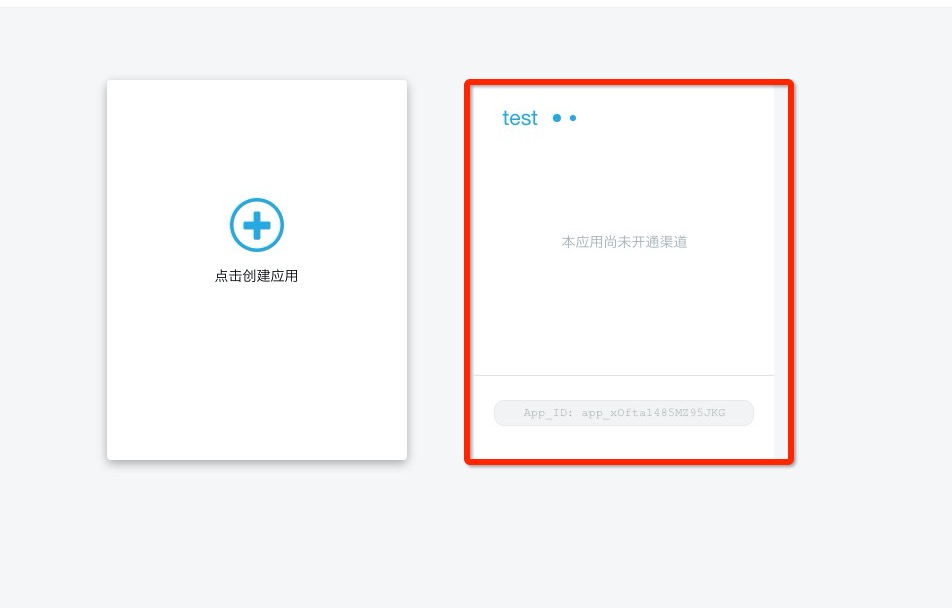
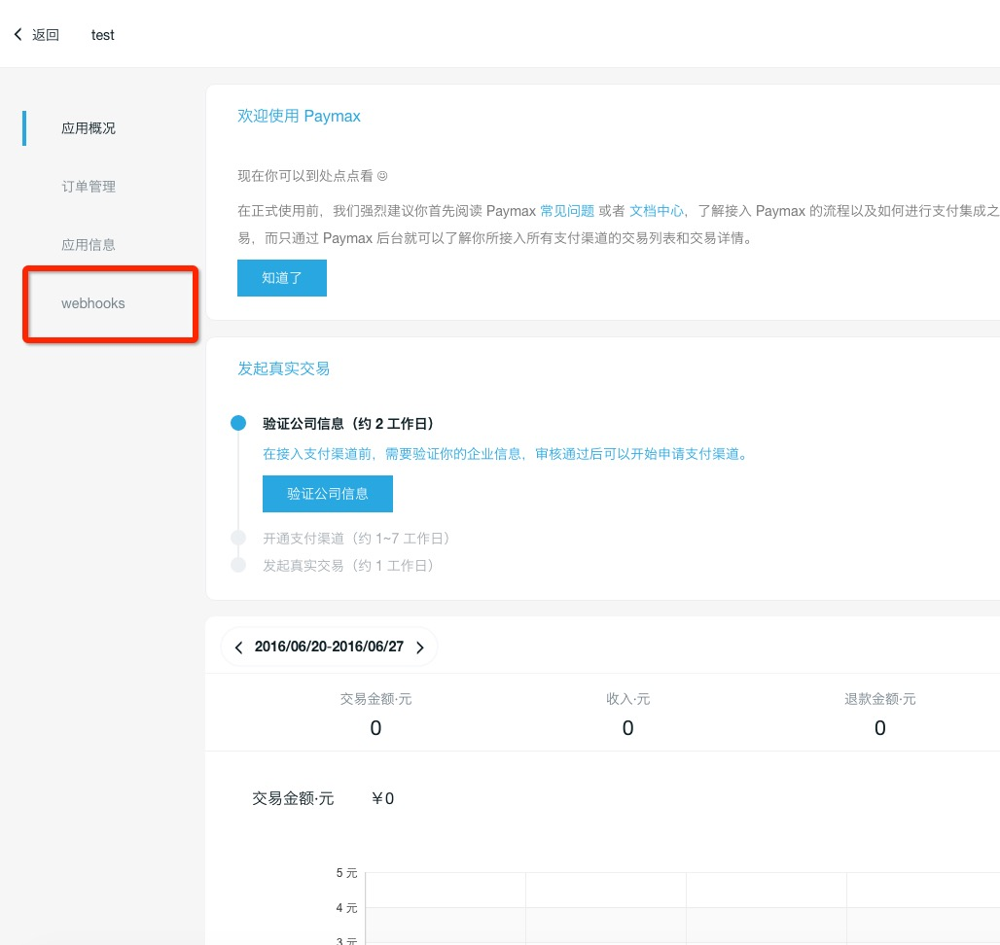
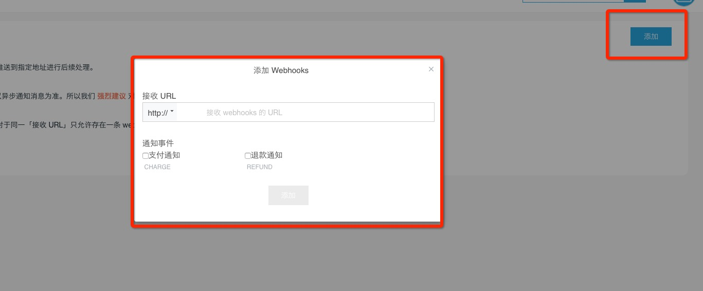

##webhooks通知


###什么是webhooks通知？
通过配置 webhooks，商户可订阅需要的事件，当这些事件发生时，paymax会将对应的事件消息推送到商户指定的地址。paymax现支持如下webhooks：</br>

* 支付结果通知
* 退款结果通知


###如何订阅
1.从应用列表里点击某应用

 

2.点击左侧导航中webhooks



3.点击右上角添加按钮，开始添加webhooks




###可靠通知规则
由于网络等原因，商户可能未接收或未正常处理webhooks通知，paymax会通过一定重发机制来保证通知的可靠性。

paymax是否重发，取决于商户收到通知后response的结果是否为success字符串。若不是，才会按照一定机制重发，直到收到success为止。

当然，paymax重发的时间间隔也会随着重发次数逐步变长。


###通知格式

**示例**

```

 {
 	"data": {
 		"amount": 0.01,
 		"body": "测试商品",
 		"client_ip": "127.0.0.1",
 		"currency": "CNY",
 		"description": "测试商品描述信息",
 		"id": "ch_846b3840118646249aba1e8f",
 		"livemode": false,
 		"order_no": "ETEN201606272002045rCT",
 		"status": "SUCCEED",
 		"subject": "测试商品标题",
 		"time_expire": 1467032503680,
 		"transaction_no": "201606060001365501"
 	},
 	"notifyNo": "evt_902f9912b51b4f62963382f2b796d899",
 	"timeCreated": 1467028926044,
 	"type": "CHARGE"
 }

```

**参数说明**

| 参数              | 类型      | 描述                                       |
| -------------- | ------- | ---------------------------------------- |
|      data     |    Charge对象  |  详情见 [API文档](API文档.md#支付) 中对Charge对象的说明 |
| notifyNo    |   String|  通知事件唯一标识 |
| timeCreated | Long  | 时间戳，自1970年以后的毫秒数  |
| type |  String |  通知类型，共以下几种:<br/> CHARGE : 支付 <br/> REFUND : 退款 |


###如何验签

每一次事件通知，paymax都会对request body整体做签名，并将签名后的结果放request header中，header名称sign。

签名算法为SHA1WithRSA，签名时会使用paymax官方私钥做签名，所以商户验签时需要用paymax官方公钥来做验签。

paymax官方公钥可通过商户后台“开发信息”中获取。


