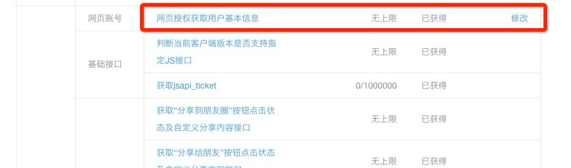
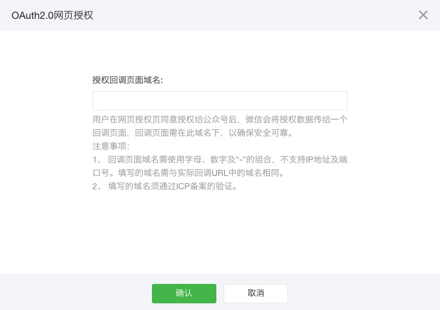

## 微信公众号支付对接流程

对接微信公众号支付，大致分为如下几个步骤：

1. **获取用户openid.**
2. **下单：** 调用paymax“发起支付接口”完成。
3. **调出支付控件：** 调用微信JS SDK， 使用上一步“发起支付接口”返回的参数，调出微信支付控件。
4. **处理支付结果：** 用户支付完成后，根据js sdk返回的结果，跳转到相应的支付成功或失败页面。


下面将对每一步做详细说明：


###第一步、获取用户openid
####前提条件：OAuth2.0网页授权

OAuth2.0网页授权操作步骤：<a href="https://mp.weixin.qq.com/">登录公众平台</a> -> 点击左侧导航中“接口权限” -> 修改“授权域名”

如下：

点击左侧导航中“接口权限”示例图


修改“授权域名”示例图


修改“授权域名”示例图



####获取openid方法
1.引导用户在微信中打开如下链接，获取code：
 
	https://open.weixin.qq.com/connect/oauth2/authorize?appid=appid&redirect_uri=redirect_uri&response_type=code&scope=snsapi_userinfo&state=state#wechat_redirect

说明：上述链接访问完成后，微信会redirect到商户自己的服务器上（既redirect_uri设置的值），并带上code参数。需要注意的是redirect_uri必须在“OAuth2.0网页授权”授权的域名内。

详情见<a href="https://mp.weixin.qq.com/wiki?t=resource/res_main&id=mp1421140842&token=&lang=zh_CN">微信官方文档</a>

2.发送如下http get请求，获取open_id

https://api.weixin.qq.com/sns/oauth2/access_token?appid=appid&secret=secret&code=code&grant_type=authorization_code


详情见<a href="https://mp.weixin.qq.com/wiki?t=resource/res_main&id=mp1421140842&token=&lang=zh_CN">微信官方文档</a>


	

###第二步、下单
根据[Paymax API](API文档.md)文档中描述，调用“发起支付接口”。

说明：这步下单需要传入open_id，具体方法[Paymax API](API文档.md)中“支付渠道附加参数”。

###第三步、调出支付控件

####前提条件：公众号支付授权目录设置成功
说明：公众号支付授权目录设置，不同于OAuth2.0网页授权设置。需要在申请“微信公众号支付”渠道开通后，由paymax运营人员设置，只有此在目录下才能调起微信支付控件。

####调用支付控件方法
用户在商户的h5页面上点击支付后，需要将用户引导到支付授权目录，在此页面调起支付控件。示例代码如下：

```javascript
function onBridgeReady(){
   WeixinJSBridge.invoke(
       'getBrandWCPayRequest', {
           "appId" ： "wx2421b1c4370ec43b",     //公众号名称，由商户传入     
           "timeStamp"：" 1395712654",         //时间戳，自1970年以来的秒数     
           "nonceStr" ： "e61463f8efa94090b1f366cccfbbb444", //随机串     
           "package" ： "prepay_id=u802345jgfjsdfgsdg888",     
           "signType" ： "MD5",         //微信签名方式：     
           "paySign" ： "70EA570631E4BB79628FBCA90534C63FF7FADD89" //微信签名 
       },
       function(res){     
           if(res.err_msg == "get_brand_wcpay_request：ok" ) {}     // 使用以上方式判断前端返回,微信团队郑重提示：res.err_msg将在用户支付成功后返回    ok，但并不保证它绝对可靠。 
       }
   ); 
}
if (typeof WeixinJSBridge == "undefined"){
   if( document.addEventListener ){
       document.addEventListener('WeixinJSBridgeReady', onBridgeReady, false);
   }else if (document.attachEvent){
       document.attachEvent('WeixinJSBridgeReady', onBridgeReady); 
       document.attachEvent('onWeixinJSBridgeReady', onBridgeReady);
   }
}else{
   onBridgeReady();
}
```
说明：

上述代码中所有参数，都可以通过第二步下单的返回结果中获取到；

关于调起支付控件的细节，可参看<a href="https://pay.weixin.qq.com/wiki/doc/api/jsapi.php?chapter=7_7&index=6">微信官方文档</a>


###第四步、处理支付结果
在第三步的js代码的callback函数中，根据支付结果，继续后续页面流程。比如：跳转到成功页面。

说明：callback函数中的支付结果并不是绝对可靠，实际支付结果还需要依靠webhooks通知，或者“查询支付”接口。
