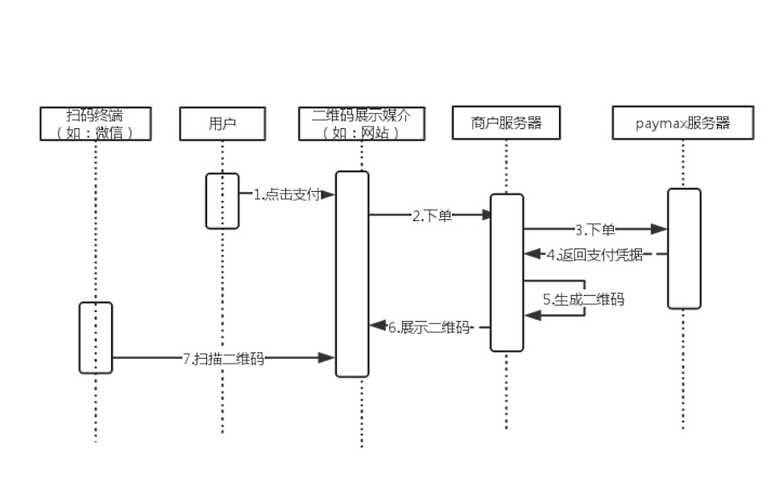

## 扫码支付流程（C扫B）

C扫B既用户扫描商户二维码，流程图如下

以下流程介绍，以用户扫描商户网站上的二维码为例

1. 用户在商户网站上点击支付。
2. 商户网站向商户服务器发起支付（下单）请求。
3. 商户服务器自己生成完内部订单后，调用paymax服务器接口，发起下单请求。
4. paymax服务器此刻会向支付渠道下单（如：支付宝、微信），并将支付渠道返回的支付凭据返回给商户服务器。
5. 商户服务器将支付凭据（通常是一个链接）生成二维码图片；生成二维码的步骤也可放到网页上通过javascript完成。
6. 将上一步生成的二维码图片展示到网站。
7. 用户使用微信客户端扫描二维码，并进行后续支付。

***说明***

由于扫码完成后，并没有后续页面跳转流程，所以商户需要依靠[webhooks通知](webhooks通知.md)或者[查询支付接口](API文档#查询支付)获取订单支付状态，并展示给用户。

