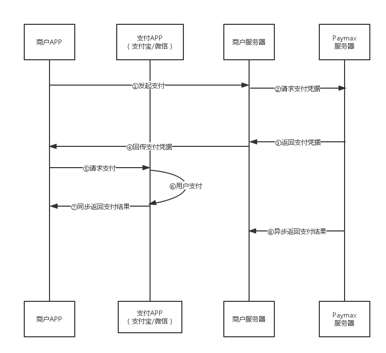
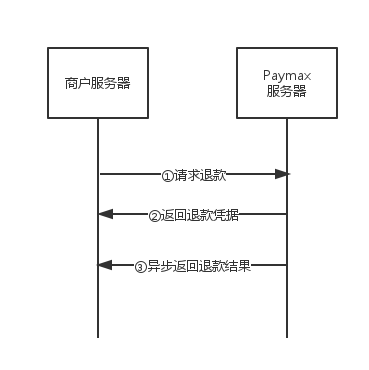

Paymax的交易类型有两种，支付和退款。

### 支付流程

以移动应用支付场景来示例：

1. 商户APP需要接入对应平台的Client SDK，商户服务器需要接入相应语言的Server SDK或者自行调用[Paymax API](API文档.md)
2. 在商户APP上需要付款时，通过商户APP向商户服务器发起支付请求①，商户服务器拿到支付请求时，将支付要素提交给Paymax服务器请求支付凭据②
3. 请求成功后，Paymax服务器会返回该笔支付的支付凭据③；商户服务器拿到支付凭据，校验过合法性之后，就可以将其回传给商户APP④
4. 商户APP拿到服务器回传过来的支付凭据，调用Client SDK的接口调起支付应用（微信、支付宝等）⑤，用户在应用中完成支付⑥
5. 支付完成之后，Client SDK会向用户APP同步返回支付结果，客户端根据返回结果提示用户支付结果⑦。
6. 同时，Paymax服务器会主动向商户的服务器通知支付结果⑧，请以此支付结果为准。

### 退款流程

退款交易过程主要发生在商户服务器和Paymax服务器之间。

1. 商户服务器向Paymax服务器发起退款请求①（可以通过接入Server SDK或者自行调用[Paymax API](API文档.md)来实现）
2. 请求成功后，Paymax服务器会返回退款凭据②
3. 当退款完成之后，Paymax服务器会主动向商户服务器通知退款结果③

各渠道的退款流程有所不同，具体请参考“关于渠道和退款”。
